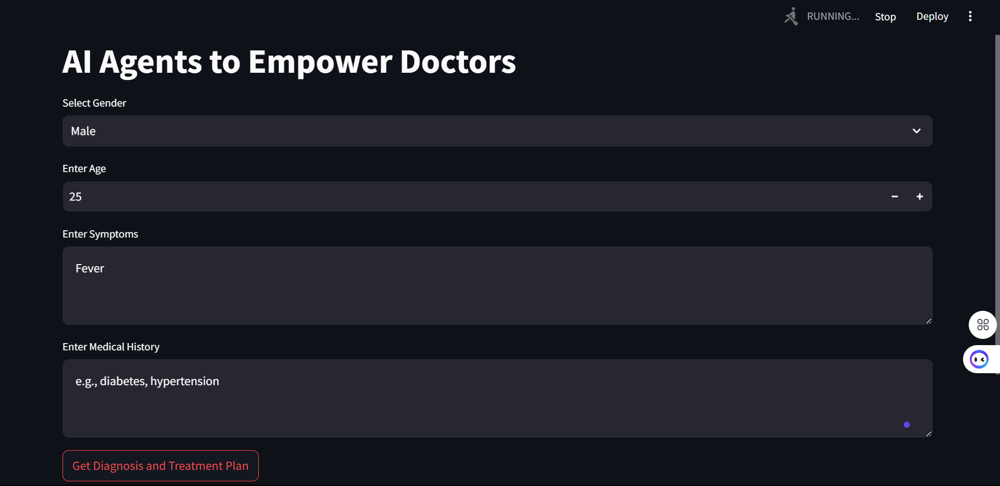
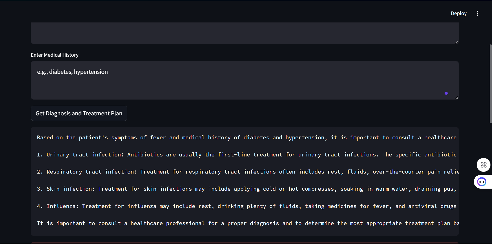

# AI-Powered Healthcare Diagnosis Assistant

## Query

## Response

## Overview
This project leverages AI agents to assist healthcare professionals in generating preliminary diagnoses and treatment recommendations. Built using CrewAI and Streamlit, it creates a user-friendly interface where medical practitioners can input patient information and receive structured diagnostic insights.

## Key Features
- Interactive web interface for patient data input
- AI-powered diagnosis generation
- Automated treatment recommendations
- Downloadable reports in DOCX format
- Real-time medical information retrieval

## Technology Stack
- **CrewAI**: Orchestrates multiple AI agents working together
- **Streamlit**: Powers the web interface
- **SerperDev API**: Enables real-time medical information search
- **OpenAI GPT**: Drives the underlying language model
- **Python-docx**: Generates downloadable reports

## How It Works

### Agent Structure
1. **Medical Diagnostician Agent**
   - Analyzes patient symptoms and medical history
   - Generates preliminary diagnoses
   - Uses SerperDev for up-to-date medical information

2. **Treatment Advisor Agent**
   - Creates customized treatment plans
   - Considers patient history and diagnosis
   - Recommends medications and lifestyle changes

### Information Flow
1. User inputs patient details (gender, age, symptoms, medical history)
2. Diagnostician agent analyzes the input using SerperDev API for current medical data
3. Treatment advisor receives diagnosis and creates a treatment plan
4. System generates a comprehensive report
5. User can view results and download a formatted DOCX report

## Why CrewAI?
CrewAI enables the creation of autonomous AI agents that can work together, making it perfect for complex medical diagnosis scenarios where multiple perspectives and areas of expertise are needed. The framework allows for:
- Structured agent interactions
- Task delegation
- Sequential processing of medical information
- Autonomous decision-making

## Role of SerperDev
SerperDev API serves as a crucial tool for:
- Real-time medical information retrieval
- Verification of symptoms and conditions
- Access to current treatment protocols
- Cross-referencing medical data

